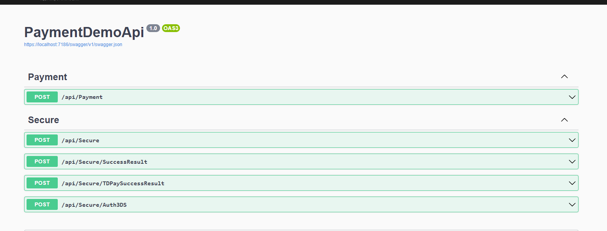

# merchant-pay-api

`merchant-pay-api` is a backend service built with .NET Core that receives payment form data from the frontend, validates and transforms it into the required format, and forwards it to a virtual POS (vPOS) gateway. It supports both Secure (3D Secure) and NonSecure transaction types.

## 🔧 Core Responsibilities

- Accepts and validates incoming payment requests
- Formats data according to the vPOS gateway protocol
- Handles both Secure and NonSecure transaction flows
- Manages communication with the vPOS gateway via HTTP
- Provides error handling and transaction status feedback

## 🚀 Technologies Used

- ASP.NET Core Web API
- FluentValidation for input validation
- RESTful API design
- JSON-based data contracts
- Middleware for request/response processing
- HMACSHA512 for cryptographic hashing

---

This API acts as a secure and flexible middleware between your frontend payment UI and the external vPOS system.
